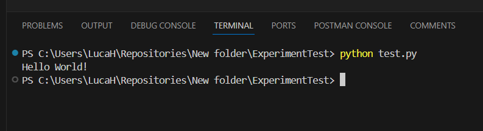

# ExperimentTest

Das Repository ist zum Test eurer Entwicklungsumgebung.
Clont das Repository und führt die test.py Datei aus.
Sollte die Ausgabe "Hello World" sein, dann ist eure Entwicklungsumgebung richtig eingerichtet.

## Anleitung

1. Öffnet das GitHub Repository und kopiert den Link

2. Clont das Repository in eure Entwicklungsumgebung

3. Führt die test.py Datei aus

oder über die Konsole

